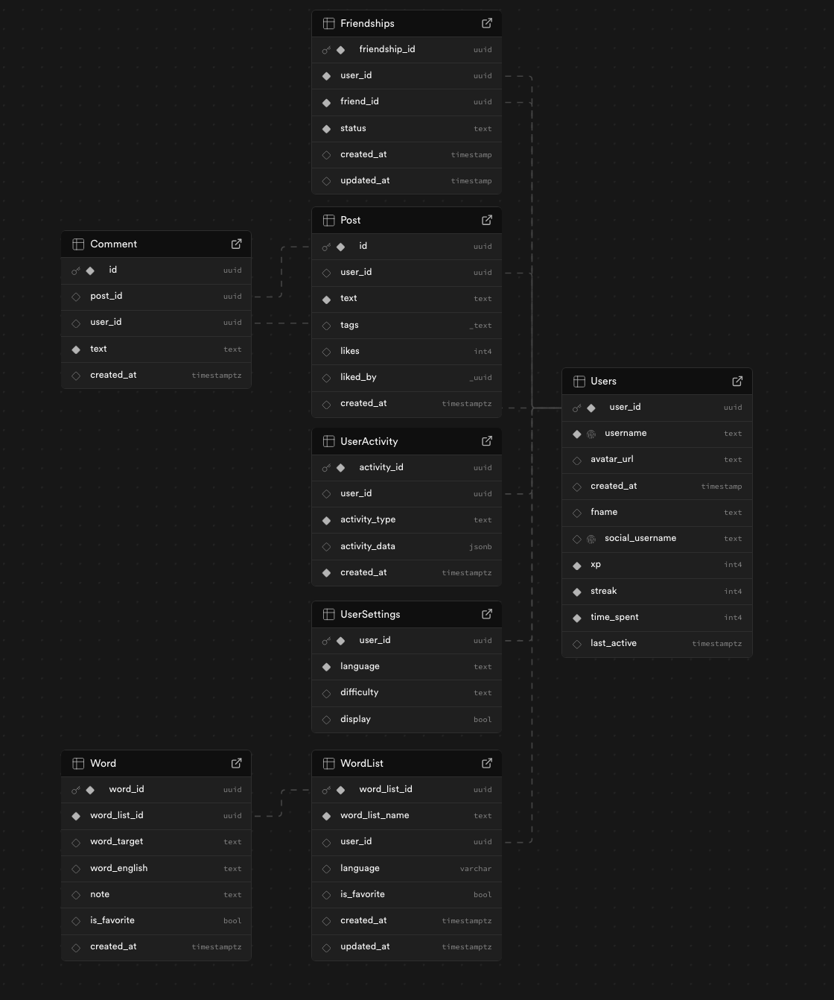

# Fluentures 🐪

*An immersive, oasis-themed language learning app by Team camelCase for Mizzou's Senior Capstone course.*

Leave the days of rote memorization behind and take your learning journey on an adventure through the desert with Fluentures. Explore and advance your horizons by creating new Oases on your Map. Each Oasis is your own custom word list with words you want to learn. Visit your Oases to practice vocabulary using one of four AI-powered learning features. Edit and favorite words anytime. The learning features use AI to create natural, conversational learning experiences—just like being immersed in the language. Social features and a Logbook (user statistics) keep you engaged and on track.

## Team Members
Angela Amaro, Seth Ek, Seth Keenan, Seohyun (Jay) Kim, Kody McNamara, Evie Wilbur

---

## Main Features

### Map
The Map is your central hub where all your Oases (word lists) are displayed in a beautiful 3D desert environment. Each Oasis appears as a unique location that you can click to access. The map updates based on your selected learning language, showing only the Oases relevant to that language. Use the map to:
- View all your created Oases at a glance
- Navigate to specific word lists by clicking on them
- Access the edit mode to create new Oases or remove existing ones
- Track your learning journey visually

### Oases
Each Oasis is a custom vocabulary collection focused on a specific theme or topic. You can create as many Oases as you want for different subjects (e.g., "Food Vocabulary," "Travel Phrases," "Business Terms"). Inside each Oasis, you have access to four distinct learning modes:

#### Story Mode
An interactive storytelling experience powered by AI (Google Gemini). The AI generates an engaging story that naturally incorporates your vocabulary words. You can:
- Generate unique stories based on your word list
- Chat with the AI to continue or modify the story
- See your target vocabulary used in context
- Practice reading comprehension while learning new words

#### Sentences Mode
Practice individual vocabulary words through AI-generated example sentences. This feature:
- Creates contextual sentences for each word in your list
- Allows you to regenerate sentences if you want different examples
- Includes an AI chat interface to ask questions about usage
- Helps you understand how words are used in real situations

#### Quizzes
Test your knowledge with two interactive quiz formats:
- **Word Matching**: Match target language words with their English translations in a tile-based game
- **Written Quiz**: Type the correct translations to test your recall
Both quiz types provide immediate feedback and track your progress.

#### Editing Your Oasis
Customize your word lists with a powerful editing interface:
- Add up to 20 words per Oasis (target word, English translation, and optional notes)
- Mark words as favorites for quick reference
- Rename your Oasis to better reflect its theme
- Get AI-powered suggestions for additional vocabulary based on a theme
- Receive AI recommendations for related words to expand your list
- Save changes with real-time validation

### Logbook
Your personal statistics dashboard displays comprehensive learning analytics:
- **Total Words**: See how many words you've added across all Oases
- **Current Streak**: Track consecutive days of practice
- **Study Time**: Monitor total time spent learning
- **Favorites Count**: View your most important words
- **Progress Visualization**: Charts and graphs showing your learning journey
- **Recent Activity**: List of recently practiced words
- **Favorites Panel**: Quick access to all your favorited vocabulary
The Logbook is presented in an elegant book-themed interface with page-turning animations.

### Social Features
Connect with other learners through the social feed:
- Create posts to share your learning experiences, tips, or achievements
- Use hashtags to categorize content (e.g., #Japanese, #StudyTips)
- Like and comment on posts from other users
- Add friends to build your learning community
- Filter posts by tags to find relevant content
- View and manage friend requests
- Search for other learners by username

---

## Additional Features

### Account Management
- Secure user authentication with email/password
- Password reset functionality
- User profile management
- Session persistence across visits

### Settings
Customize your learning experience:
- **Language Selection**: Choose your target language (Japanese, Spanish, etc.)
- **Difficulty Level**: Set your proficiency level (Beginner, Intermediate, Advanced)
- All settings are saved automatically to your profile

### Mobile Support
Fluentures is fully responsive and optimized for mobile devices. The interface adapts seamlessly to different screen sizes, providing an excellent learning experience whether you're on desktop, tablet, or smartphone.

---

## Tech Stack & Development

### Core Technologies
- **Frontend Framework**: [Next.js](https://nextjs.org/) 15.3.6 (React 19.0.1)
- **Language**: [TypeScript](https://www.typescriptlang.org/) 5.x
- **Styling**: [Tailwind CSS](https://tailwindcss.com/) 4.x
- **3D Graphics**: [Three.js](https://threejs.org/) 0.180.0 with [@react-three/fiber](https://docs.pmnd.rs/react-three-fiber) 9.3.0
- **Animations**: [Framer Motion](https://www.framer.com/motion/) 12.23.12

### Backend & Database
- **Database**: [Supabase](https://supabase.com/) (PostgreSQL)
- **Authentication**: Supabase Auth (@supabase/ssr 0.7.0)
- **Real-time Features**: Supabase Realtime subscriptions

### AI Integration
- **AI Provider**: [Google Gemini API](https://ai.google.dev/) (@google/generative-ai 0.24.1)
- Used for story generation, sentence creation, and vocabulary recommendations

### Additional Tools
- **Icons**: Font Awesome 7.0.1, Lucide React 0.539.0
- **Forms**: React Hook Form 7.60.0
- **Date Handling**: Day.js 1.11.19
- **HTTP Client**: Axios 1.10.0

### Development Tools
- **Testing**: Vitest 3.2.4 with React Testing Library 16.3.0
- **Linting**: ESLint 9.x with Next.js config
- **Build Tool**: Next.js with Turbopack

### Requirements
To develop Fluentures locally, you need:
- **Node.js**: Version 20.x or higher
- **npm**: Version 8.x or higher (included with Node.js)
- **Supabase Account**: For database and authentication services
- **Google Gemini API Key**: For AI-powered features

### Getting Started
1. Clone the repository
2. Install dependencies:
   ```bash
   npm install
   ```
3. Set up environment variables (create `.env.local`):
   - Supabase URL and keys
   - Google Gemini API key
4. Run the development server:
   ```bash
   npm run dev
   ```
5. Open [http://localhost:3000](http://localhost:3000) in your browser

### Available Scripts
- `npm run dev` - Start development server with Turbopack
- `npm run build` - Create production build
- `npm start` - Run production server
- `npm run lint` - Run ESLint checks
- `npm test` - Run Vitest test suite

---

## Database Documentation
### Current Schema:


